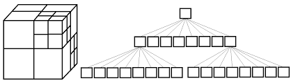

# Triangles
Second project to the Ilab course.

## Levels

#### LVL1 (done): 
the input is the number N followed by N of triangles (in 3D). 
The output is the numbers of intersecting triangles. 
Sell not for N ^ 2.

##### Algorithm
- Two triangles. \
LALib is a small library to help you with linear algebra. \
To view the algorithm of intersection of two triangles 
see source file /LAL/math/LALmath.cpp (~830 line).
    
- [Octree](https://en.wikipedia.org/wiki/Octree) \
Holder file: /Octree/Octree.h \
 

#### LVL2 (in dev):
Render your triangles using the [Vulkan API](https://www.khronos.org/vulkan/).
A 3D scene should consist of:
* Fixed volume where all triangles are located
* All triangles drawn in blue
* Triangles intersecting with others, drawn in red
* There should be at least trivial lighting
* And it should be possible to control the camera, flying around the scene, 
zooming in and out of the camera (with a mouse or keyboard)

##### Developer diary
* Day 1 \
Read the [official tutorial](https://vulkan-tutorial.com/). 
Honestly writing code as we read and trying to figure it out.

* Day 2 \
You understand that the tutorial is of little use (for me personally). 
You copy the text from the last part and experiment with it.
I catch an error with JSON but it seems to work.

* Day 3 \
Bump into a [book](https://www.litres.ru/grehem-sellers/vulkan-rukovodstvo-razrabotchika-oficialnoe-rukovo-27071853/).

* Day 5 \
Still reading a book. \
      + http://www.ogldev.org/www/tutorial50/tutorial50.html

* Day 6 \
Updating my IDE vs2019. That was a bad idea ... Now intellisence is sooooo slow and impossible to work.
(I'm waiting for 'softly' to release an update on win10 with blue screen support) \
Replacement: vs2019 -> CLion. \
I spend a lot of time trying to build a project through cmake, 
but I didn’t come to success 
(I caught a couple more errors (yes, I got banned from Google)). \
Replacement: Windows 10 -> Ubuntu. \
Another hour to install the components.
3rd hour of the night. \
The project is finally ready.

* 5 years later: \
sent for verification LVL2

## License
GNU General Public License v3.0

